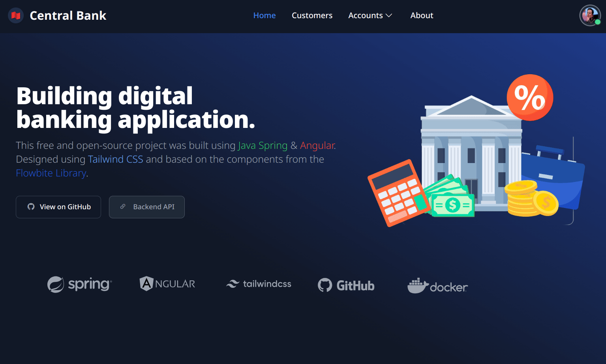

# Ebanking Frontend

 [Backend: Ebanking-Spring](https://github.com/0xUNS/Ebanking-Spring-Banckend)

 [Frontend: Ebanking-Angular](https://github.com/0xUNS/Ebanking-Angular-Frontend)

 Angular

##  Development server


```bash
npm install
ng serve
```

Go to: [localhost:4200](http://localhost:4200/).

#  Demo



#  Deployment

[On Netlify : playful-jalebi-4c1631.netlify.app](https://playful-jalebi-4c1631.netlify.app/)
